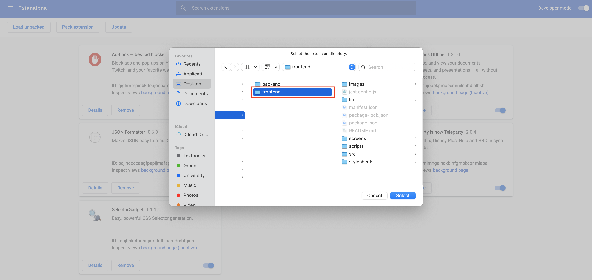
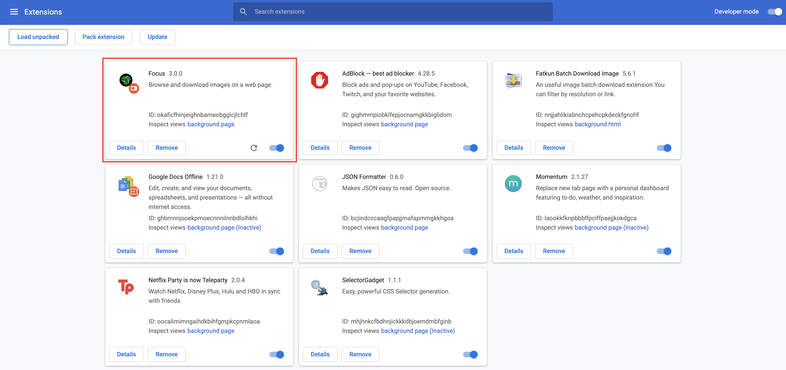

# Focus - Frontend

**Focus** is a Google Chrome Extension, that utilizes machine learning to
 remove the background of an image. Although Focus can remove background
  on all images, it works best with images that contain people.

### How Focus Works :computer: 
Focus is dependent on a pre-trained Tensorflow model explained 
[here](https://towardsdatascience.com/background-removal-with-deep-learning-c4f2104b3157).
Through semantic segmentation, Focus will classify the object as either a
the background, or an object. 
   
#### Running the Google Chrome Extension
To use, clone the repo and drop the whole folder into the chrome extension page
[here](chrome://extensions)   
Alternatively, follow the steps seen below:

1. Head to [chrome://extensions](chrome://extensions) and turn on developer
 mode
   
2. Select `Load unpacked` 
   
3. Select the `frontend` cloned repository
   
4. Begin using Focus

